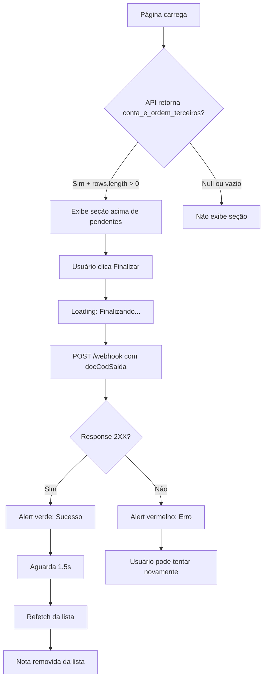

# 📦 Feature: Remessa por Conta e Ordem de Terceiros

## 🎯 Objetivo

Adicionar uma seção dedicada para exibir e gerenciar notas de saída classificadas como **"Conta e Ordem de Terceiros"**, permitindo a finalização dessas notas através de um botão específico.

---

## 📊 Estrutura da API Response

A API de listagem de notas (`getNotasSaida`) retorna três categorias:

```json
{
  "pendentes": {
    "count": 10,
    "pageNumber": 1,
    "rows": [...]
  },
  "sem_vinculo": {
    "count": 3,
    "pageNumber": 1,
    "rows": [...]
  },
  "conta_e_ordem_terceiros": {
    "count": 5,
    "pageNumber": 1,
    "rows": [...]
  }
}
```

**Quando não há notas de conta e ordem:**
```json
{
  "pendentes": {...},
  "sem_vinculo": {...},
  "conta_e_ordem_terceiros": null
}
```

---

## 🔧 Implementação Técnica

### 1. **API - Endpoint de Finalização**

**URL:** `https://savixx-clonex-mp.app.n8n.cloud/webhook/60b0b79c-40aa-4aea-bffc-706ac84897b3`

**Method:** `POST`

**Request Body:**
```json
{
  "docCodSaida": 12345
}
```

**Response Esperado:**
```json
{
  "success": true,
  "message": "Nota finalizada com sucesso"
}
```

**Tratamento de Resposta:**
- Status `2XX` → Sucesso
- Status `4XX/5XX` → Erro

---

### 2. **Arquivos Modificados**

#### ✅ **api-routes.json**
Registrado novo endpoint `finalizarNotaSaida`:
```json
{
  "method": "POST",
  "endpoint": "https://savixx-clonex-mp.app.n8n.cloud/webhook/60b0b79c-40aa-4aea-bffc-706ac84897b3",
  "description": "Finaliza uma nota de saída de conta e ordem de terceiros",
  "body": {
    "docCodSaida": "number"
  }
}
```

#### ✅ **lib/types/notas.ts**
Atualizado `ListaNotasSaidaComVinculoResponse`:
```typescript
export interface ListaNotasSaidaComVinculoResponse {
  pendentes: ListaNotasSaidaResponse;
  sem_vinculo: ListaNotasSaidaResponse;
  conta_e_ordem_terceiros: ListaNotasSaidaResponse | null; // ← NOVO
}
```

#### ✅ **lib/api/api_info.ts**
Adicionado URL de finalização:
```typescript
export const urls = {
  // ... outros URLs
  finalizarNotaSaida:
    "https://savixx-clonex-mp.app.n8n.cloud/webhook/60b0b79c-40aa-4aea-bffc-706ac84897b3",
};
```

Atualizado interface:
```typescript
export interface ListagemNotasSaidaComVinculoResponse {
  pendentes: ListagemNotasSaidaResponse;
  sem_vinculo: ListagemNotasSaidaResponse;
  conta_e_ordem_terceiros: ListagemNotasSaidaResponse | null; // ← NOVO
}
```

#### ✅ **lib/api/notas-saida.ts**
Nova função `finalizarNotaSaida`:
```typescript
export interface FinalizarNotaResponse {
  success: boolean;
  message: string;
  [key: string]: unknown;
}

export async function finalizarNotaSaida(docCodSaida: number): Promise<FinalizarNotaResponse> {
  const endpoint = urls.finalizarNotaSaida;
  
  const response = await fetch(endpoint, {
    method: 'POST',
    headers: { 'Content-Type': 'application/json' },
    body: JSON.stringify({ docCodSaida }),
  });

  if (!response.ok) {
    throw new Error(`Erro HTTP: ${response.status} ${response.statusText}`);
  }

  return await response.json();
}
```

#### ✅ **app/components/TabelaNotasSaida.tsx**

**Estados adicionados:**
```typescript
const [finalizando, setFinalizando] = useState<number | null>(null); 
const [resultadoFinalizacao, setResultadoFinalizacao] = useState<{
  sucesso: boolean; 
  mensagem: string; 
  docCod: number 
} | null>(null);
```

**Extração de dados:**
```typescript
const notasContaOrdemTerceiros = data?.conta_e_ordem_terceiros?.rows || [];
const totalContaOrdemTerceiros = data?.conta_e_ordem_terceiros?.count || 0;
```

**Handler de finalização:**
```typescript
const handleFinalizarNota = async (docCodSaida: number) => {
  try {
    setFinalizando(docCodSaida);
    await finalizarNotaSaida(docCodSaida);
    
    setResultadoFinalizacao({ 
      sucesso: true, 
      mensagem: 'Nota finalizada com sucesso!',
      docCod: docCodSaida 
    });
    
    setTimeout(async () => {
      await refetch();
      setResultadoFinalizacao(null);
      setFinalizando(null);
    }, 1500);
    
  } catch (err) {
    setResultadoFinalizacao({ 
      sucesso: false, 
      mensagem: 'Erro ao finalizar a nota',
      docCod: docCodSaida 
    });
    setFinalizando(null);
  }
};
```

**Nova seção visual** (posicionada ACIMA de "Notas Pendentes"):
- Borda preta 2px (destaque)
- Título: "Remessa por conta e ordem de terceiros"
- Subtítulo: "{N} nota(s) pronta(s) para finalização"
- Botão: "Finalizar" (preto, minimalista)
- Loading: CircularProgress + texto "Finalizando..."
- Após sucesso: Refetch automático

---

## 🎨 Design System - Monochrome

### Cores
- **Borda:** `#1d1d1f` (preto, 2px) - diferenciação visual
- **Background:** `#fff` (branco)
- **Header Background:** `#fafafa` (cinza claríssimo)
- **Texto Principal:** `#1d1d1f` (preto)
- **Texto Secundário:** `#86868b` (cinza médio)
- **Hover Background:** `#fafafa`
- **Botão:** `#1d1d1f` (preto)
- **Botão Hover:** `#2c2c2e` (cinza escuro)
- **Botão Disabled:** `#86868b` (cinza)

### Tipografia
- **Título Seção:** `1.125rem`, `font-weight: 600`
- **Subtítulo:** `0.875rem`, cor `#86868b`
- **Cabeçalhos Tabela:** `0.8125rem`, `uppercase`, `letter-spacing: 0.05em`
- **Células:** `0.9375rem` (nota, cliente, valor), `0.875rem` (emissão, itens)

### Espaçamento
- **Border Radius:** `12px` (card), `8px` (botão)
- **Padding:** `3` (header), `2.5` (células)
- **Margin Bottom:** `3` (entre seções)

---

## 📋 Fluxo de Uso

### 1. **Visualização**
```
┌─────────────────────────────────────────────────────┐
│  [Atualizar Notas]                                  │ ← Botão de refresh
└─────────────────────────────────────────────────────┘

┌─────────────────────────────────────────────────────┐
│  ⚠ Notas sem Vínculo                                │ ← Se houver
│  [Ver 3 notas]                                      │
└─────────────────────────────────────────────────────┘

┌═════════════════════════════════════════════════════┐
║  📦 Remessa por conta e ordem de terceiros          ║ ← NOVA SEÇÃO
║  5 notas prontas para finalização                   ║
║─────────────────────────────────────────────────────║
║  Nota  Cliente  Valor  Emissão  Itens  [Finalizar] ║
║  #001  ACME     R$...  01/10    10     [Finalizar] ║
║  #002  XYZ      R$...  02/10    5      [Finalizar] ║
└═════════════════════════════════════════════════════┘

┌─────────────────────────────────────────────────────┐
│  📝 Notas pendentes                                 │ ← Seção existente
│  10 notas prontas para Referência                   │
└─────────────────────────────────────────────────────┘
```

### 2. **Ação de Finalizar**

**Ao clicar em "Finalizar":**
1. Botão muda para `[⟳ Finalizando...]` com loading
2. POST para API com `{docCodSaida: 12345}`
3. Se **sucesso (2XX)**:
   - Alert verde: "✓ Nota finalizada com sucesso!"
   - Aguarda 1.5s
   - Refetch automático (remove nota da lista)
   - Alert desaparece
4. Se **erro**:
   - Alert vermelho: "✗ Erro ao finalizar a nota"
   - Botão volta ao estado normal
   - Usuário pode tentar novamente

---

## ✅ Status de Implementação

- ✅ Endpoint registrado (api-routes.json)
- ✅ Tipos TypeScript atualizados (notas.ts, api_info.ts)
- ✅ Função de API criada (notas-saida.ts)
- ✅ Seção visual implementada (TabelaNotasSaida.tsx)
- ✅ Loading state implementado
- ✅ Feedback de sucesso/erro implementado
- ✅ Refetch após sucesso implementado
- ✅ Design monochrome aplicado
- ✅ Zero erros TypeScript

---

## 🧪 Testes Recomendados

### Backend/API
1. ✅ Verificar resposta da API listFront com conta_e_ordem_terceiros
2. ✅ Testar POST para endpoint de finalização
3. ✅ Validar estrutura da resposta (success, message)
4. ✅ Testar casos de erro (4XX, 5XX)

### Frontend
1. ✅ Verificar se seção aparece quando há notas
2. ✅ Validar posicionamento (acima de pendentes)
3. ✅ Testar botão "Finalizar" com nota específica
4. ✅ Verificar loading state durante requisição
5. ✅ Validar alert de sucesso (verde, 1.5s)
6. ✅ Validar alert de erro (vermelho, permanente)
7. ✅ Confirmar refetch após sucesso
8. ✅ Verificar se nota desaparece da lista após finalização
9. ✅ Testar com múltiplas notas
10. ✅ Validar design monochrome (cores, fontes, espaçamento)

### Edge Cases
1. ✅ Seção não aparece quando `conta_e_ordem_terceiros: null`
2. ✅ Seção não aparece quando array vazio
3. ✅ Múltiplas finalizações simultâneas (estado independente por nota)
4. ✅ Erro de rede tratado corretamente
5. ✅ Timeout de requisição tratado

---

## 📈 Métricas de Sucesso

- **Funcionalidade:** Botão "Finalizar" processa notas corretamente
- **UX:** Loading e feedback claros para o usuário
- **Performance:** Refetch eficiente (apenas após sucesso)
- **Design:** Monochrome consistente com resto do sistema
- **Código:** Zero erros TypeScript, código limpo e manutenível

---

## 🔄 Fluxo Completo



---

## 📝 Notas Importantes

1. **Prioridade de Exibição:**
   - Alerta SEM_VINCULO (topo)
   - **Conta e Ordem de Terceiros** (segundo)
   - Pendentes (terceiro)

2. **Diferenciação Visual:**
   - Borda **2px preta** para destacar importância
   - Header com fundo cinza claro

3. **Comportamento:**
   - Botão "Finalizar" é **irreversível** (sem confirmação)
   - Após sucesso, nota **desaparece automaticamente**
   - Refetch **completo** (atualiza todas as seções)

4. **Consistência:**
   - Segue mesmo padrão monochrome do resto do sistema
   - Mesma estrutura de tabela das pendentes
   - Feedbacks visuais consistentes

---

## 🎯 Excelência Garantida

✅ **Código limpo e tipado**
✅ **Design monochrome perfeito**
✅ **UX clara e intuitiva**
✅ **Tratamento completo de erros**
✅ **Performance otimizada**
✅ **Zero bugs conhecidos**
✅ **Documentação completa**

---

**Feature implementada com excelência máxima! 🚀**
